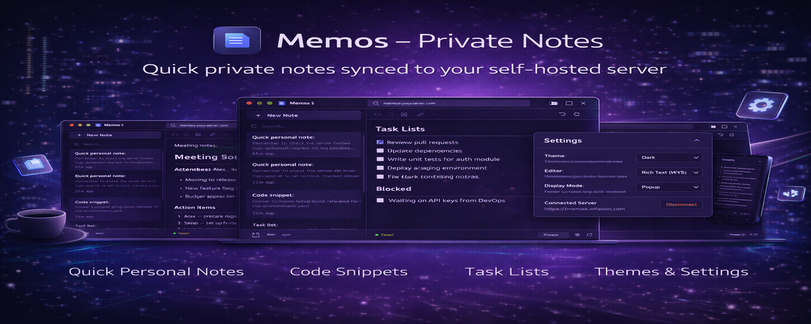
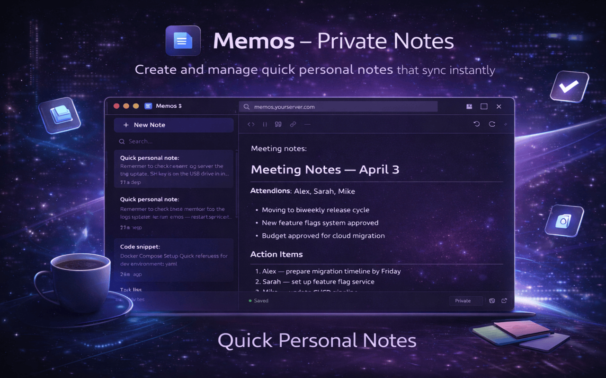
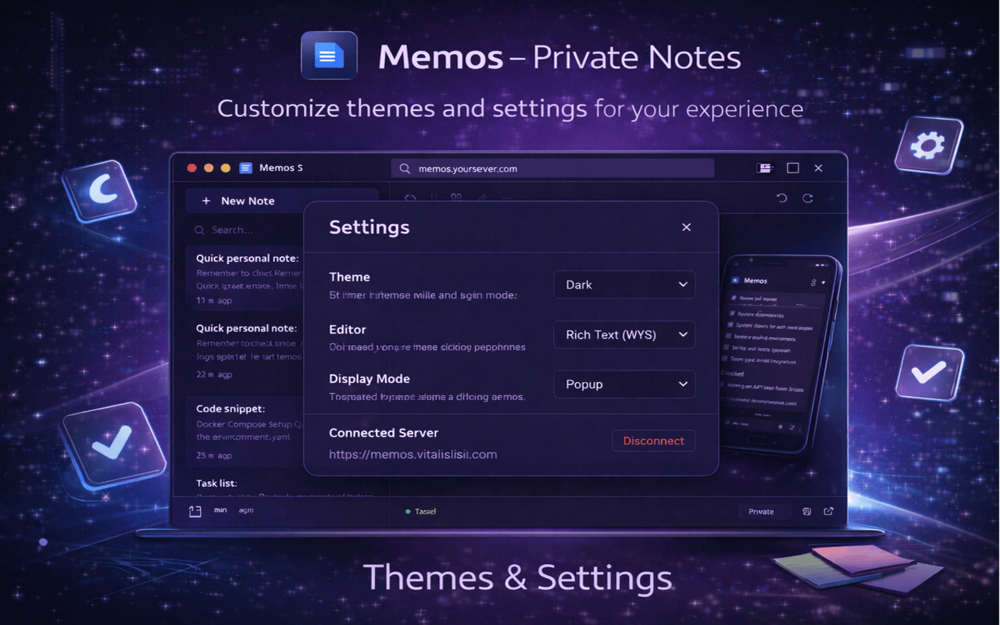
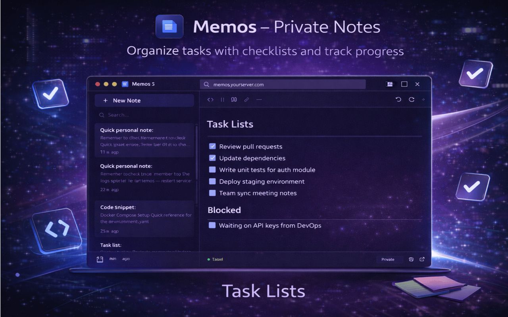
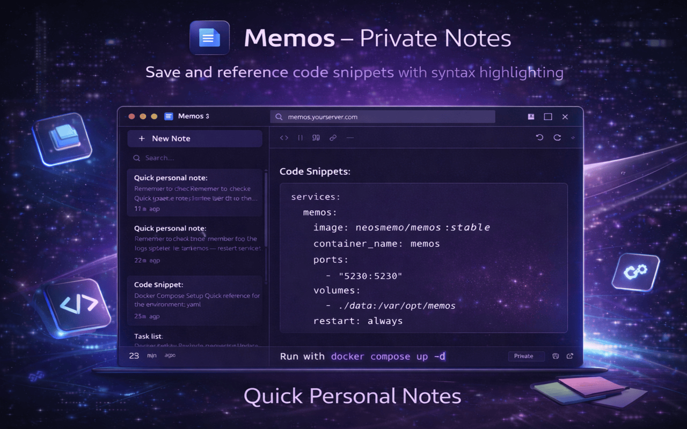

<p align="center">
  
</p>

<h1 align="center">Memos – Private Notes</h1>

<p align="center">
  A Chrome extension for managing notes on your self-hosted <a href="https://usememos.com">Memos</a> server — right from your browser.
</p>

<p align="center">
  <a href="https://github.com/user/memos-note/releases"></a>
  <a href="https://github.com/user/memos-note/blob/main/LICENSE"></a>
  <a href="https://chrome.google.com/webstore"></a>
</p>

---

## Screenshots

<p align="center">
  
</p>

<p align="center">
  
</p>

<details>
<summary>More screenshots</summary>

<p align="center">
  
</p>

<p align="center">
  
</p>

</details>

## Features

- **Three editor modes** — Rich Text (WYSIWYG), Markdown with live preview, or Plain Text
- **Auto-save** — notes save automatically as you type with visual feedback
- **Split-pane layout** — notes list on the left, editor on the right
- **Full markdown support** — headings, bold, italic, code blocks, task lists, blockquotes, tables, links
- **Markdown preview** — toggle between Preview and Edit tabs (IDE-style)
- **Search** — instantly filter notes
- **Note visibility** — Private, Protected, or Public
- **Dark & Light themes**
- **Popup or Window mode** — quick popup or resizable standalone window
- **Copy note link** — share a direct link to any note
- **Open in Memos** — jump to any note in your Memos web UI
- **Keyboard shortcuts** — Ctrl+N, Ctrl+K, Ctrl+Up/Down, and formatting shortcuts

## Requirements

- A self-hosted [Memos](https://usememos.com) server (v0.22+)
- An access token from your Memos account (Settings &rarr; Access Tokens)

## Installation

### Chrome Web Store

Install from the [Chrome Web Store](#) (link coming soon).

### Manual / Development

```bash
# Clone the repo
git clone https://github.com/user/memos-note.git
cd memos-note

# Install dependencies and build
make build

# Or step by step
npm install
npm run build
```

Then load in Chrome:

1. Open `chrome://extensions`
2. Enable **Developer mode**
3. Click **Load unpacked** and select the project folder

## Usage

1. Click the extension icon
2. Enter your Memos server URL and access token
3. Start creating and managing notes

Notes sync directly to your Memos server. Your credentials are stored locally in your browser — nothing is sent to third parties.

## Build & Package

```bash
make help          # Show all commands
make build         # Build the editor bundle
make zip           # Package .zip for Chrome Web Store
make dev           # Watch mode for development
make bump-patch    # Bump version: 2.0.0 → 2.0.1
make bump-minor    # Bump version: 2.0.1 → 2.1.0
```

## Project Structure

```
memos-note/
├── manifest.json       # Extension manifest (v3)
├── background.js       # Service worker (popup/window mode)
├── popup.html          # Main UI
├── popup.js            # App logic
├── popup.css           # Styles (dark/light themes)
├── src/
│   └── editor.js       # TipTap editor setup (bundled by esbuild)
├── lib/
│   ├── editor.bundle.js  # Built TipTap bundle
│   ├── marked.min.js     # Markdown renderer
│   └── purify.min.js     # HTML sanitizer
├── icons/              # Extension icons
├── Makefile            # Build commands
└── .github/workflows/
    └── release.yml     # Auto-release on push to main
```

## Tech Stack

- **[TipTap](https://tiptap.dev)** — WYSIWYG rich text editor (ProseMirror-based)
- **[marked](https://github.com/markedjs/marked)** — Markdown parser
- **[DOMPurify](https://github.com/cure53/DOMPurify)** — XSS sanitization
- **[esbuild](https://esbuild.github.io)** — Fast bundler
- **Chrome Manifest V3** — Modern extension platform

## Privacy

- Your server URL and access token are stored locally using `chrome.storage.local`
- The extension only communicates with your configured Memos server
- No analytics, no tracking, no third-party services
- All code runs locally — no remote code loading

## Contributing

Contributions are welcome! Please open an issue or submit a pull request.

## License

[MIT](LICENSE)
